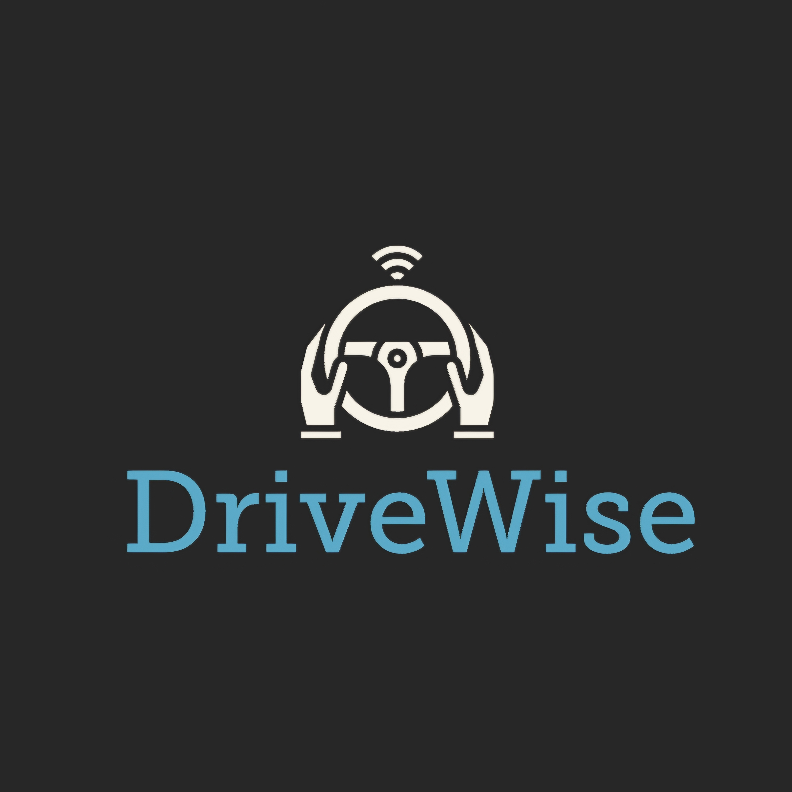

# DriveWise  

  

## Project Description  
DriveWise is an innovative driving analytics mobile application designed to promote safer driving practices and provide in-depth driving behavior analysis. Using your smartphone's built-in sensors such as the accelerometer, gyroscope, and GPS, DriveWise tracks and analyzes driving behavior to detect sudden braking, sharp turns, rapid acceleration, and more.  

With its gamification features, DriveWise encourages users to achieve better driving scores by competing against their previous performance and earning badges for milestones. This app is ideal for users who want to improve their driving habits while enjoying a fun and interactive experience.  

## Features  
- **Driving Behavior Analyzer**: Detects sudden braking, sharp turns, and rapid acceleration using smartphone sensors.  
- **GPS-Based Speed Tracking**: Monitors vehicle speed and provides real-time tracking.  
- **Trip Tracking**: Logs trip start and end times, locations, speeds, and specific driving events.  
- **Gamification**: Awards badges for achieving milestones and allows users to compete against their previous monthly scores.  
- **Detailed Reports**: Provides insights into driving performance and event-specific analysis.  

## Technologies and Tools  
- **Programming Languages**: Dart, C++, CMake, Swift, C.  
- **Frameworks**: Flutter for mobile app development.  
- **Tools**: Azure Dev Boards for sprint planning, Git & GitHub for source control.  

## Setup Instructions  
Follow the steps below to set up the project locally:  

1. Clone the repository:  
   ```git clone https://github.com/R-umaria/Group24F24.git```

2. Navigate to the project directory and fetch the project dependencies:
    ```flutter pub get```

3. Run the application:
    ```flutter run```

## Screenshots
[Landing Page](assets/images/LandingPage.jpg)


## License
This project is licensed under the GNU General Public License v3.0. See the LICENSE file for details.

## Acknowledgments
* [Flutter Documentation](https://docs.flutter.dev/)
* [GeeksforGeeks](https://www.geeksforgeeks.org/flutter-tutorial/)

We hope DriveWise inspires safer driving and contributes to a better driving experience! 🚗💨